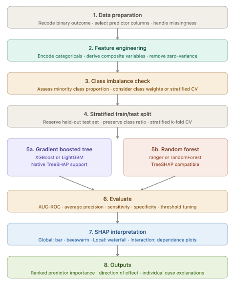

# Perinatal health data analysis — Ethiopia

## Policy question

Can routine maternal and facility data be used to identify high-risk populations, predict stillbirth risk, and characterise service delivery gaps for birthing injuries in Ethiopia?

## Overview

This repository contains analysis code for four linked data sources investigating perinatal health outcomes in Ethiopia. The work combines demographic survey data, facility-based death surveillance, routine health management information system (HMIS) data, and GPS data to characterise stillbirth burden, its determinants, and service delivery gaps for obstetric fistula and uterovaginal prolapse across Ethiopia.

## Workflow



## Repository structure

```
├── EDHS/
│   ├── explore_edhs.R           # EDHS analysis: cleaning, EDA, XGBoost, SHAP
│   ├── build_lookup_tables.R    # Maps EDHS region names → OCHA p-codes; geocodes GPS clusters to admin2/3
│   └── make_spatial_counts.R    # Aggregates stillbirths to admin units for spatial mapping
│
├── MPDSR/
│   ├── explore_mpdsr.R          # MPDSR analysis: EDA, XGBoost, SHAP
│   ├── build_lookup_tables.R    # Admin lookup tables for MPDSR facility locations
│   └── make_spatial_counts.R    # Aggregates deaths to admin units for spatial mapping
│
├── DHIS2/
│   ├── prelim_explore.R         # Step 1 — data ingestion, reshape, predictor screening, saves dhis2_stillbirth_clean.csv
│   ├── explore_dhis2.R          # Step 2 — XGBoost regression + SHAP (reads dhis2_stillbirth_clean.csv)
│   ├── sb_comparison_predictors.csv  # High vs low stillbirth predictor comparison (output of prelim_explore.R)
│   ├── shap_importance.csv           # Ranked SHAP importances (output of explore_dhis2.R)
│   ├── data/
│   │   ├── fetch_maternal_metadata.py    # Queries Ethiopian MoH DHIS2 API for available indicators
│   │   ├── fetch_maternal.py             # Downloads DHIS2 data by indicator and admin level
│   │   ├── run_fetch_maternal.sh         # Shell wrapper to run fetch_maternal.py
│   │   ├── get_dhis2_points.sh           # Downloads DHIS2 org-unit geometry points
│   │   ├── maternal_metadata.csv         # Metadata for selected indicators
│   │   └── maternal_selected_ids_log.txt # Log of selected data element IDs
│   └── spatial/
│       ├── build_lookup_tables.R    # Maps DHIS2 region_name → OCHA admin1 p-codes
│       └── make_spatial_counts.R    # Joins stillbirth counts to admin polygons for mapping
│
├── Birthing-injuries/
│   ├── fistula/
│   │   ├── fistula_gap_analysis.R   # Geographic & service delivery gap analysis for obstetric fistula
│   │   └── summaries/               # gap_summary.csv, region_summary.csv, woreda_summary.csv
│   ├── prolapse/
│   │   ├── prolapse_prevalence_analysis.R  # Prevalence & incidence analysis for uterovaginal prolapse
│   │   └── summaries/               # zonal, regional, national, and completeness summary CSVs
│   └── data/
│       ├── fetch_fistula_metadata.py    # Queries DHIS2 API for fistula/prolapse indicators
│       ├── fetch_fistula.py             # Downloads fistula and prolapse data from DHIS2
│       ├── run_fetch_fistula.sh         # Shell wrapper
│       ├── fistula_metadata.csv         # Metadata for selected indicators
│       └── fistula_selected_ids_log.txt # Log of selected data element IDs
│
├── images/
│   └── workflow.png
└── README.md
```

## Data sources and analyses

### 1. Ethiopia Demographic and Health Survey (EDHS) — `EDHS/explore_edhs.R`

The EDHS is a nationally representative household survey conducted in 2000, 2005, 2011, 2016 and 2019. Individual, birth, children, and GPS recodes were extracted and pooled across all survey waves.

**Key variables:** individual-level sociodemographic characteristics, reproductive history, antenatal care, anthropometrics, anaemia, contraception, intimate partner violence (IPV/DV composite), and stillbirth outcomes derived from pregnancy history. Spatial coordinates are GPS cluster-level (DHS-jittered).

**Models:**
- **Model 1** — binary XGBoost classifier predicting `had_stillbirth` (0/1) across all women. Outcome is rare (~1%); class imbalance handled via `scale_pos_weight` (sqrt of class ratio). 80/20 stratified train/test split, 10-fold stratified cross-validation. Performance reported as AUC-ROC, average precision, sensitivity, specificity, PPV, NPV at a chosen probability threshold.
- **Model 2** — binary XGBoost classifier predicting late vs early pregnancy loss (≥7 months vs <7 months gestation) among women with a recorded pregnancy loss. Negative finding: timing of pregnancy loss is not predictable from survey-level variables.

**Spatial pipeline:** `build_lookup_tables.R` geocodes each unique GPS cluster to admin1/2/3 via point-in-polygon join (with nearest-polygon fallback for DHS-displaced points within the stated 10 km jitter). `make_spatial_counts.R` aggregates stillbirth counts to admin units for mapping.

---

### 2. Maternal and Perinatal Death Surveillance and Response (MPDSR) — `MPDSR/explore_mpdsr.R`

The MPDSR dataset captures facility-based maternal and perinatal deaths reported through Ethiopia's national death surveillance system. Each row represents a reported death with cause, timing, and maternal characteristics.

**Key variables:** cause of death, time of death (ante/intra/postpartum), age, gravidity, parity, ANC visits, haemorrhage indicator, obstructed labour indicator, delay indicators (Delays 1–3), infectious disease comorbidities (malaria, HIV, TB, other), urban/rural residence.

**Model:** binary XGBoost classifier predicting stillbirth vs livebirth outcome among women in the MPDSR who reached labour. 80/20 stratified train/test split, 10-fold stratified cross-validation. SHAP values computed for feature importance (bar, beeswarm, dependence, and waterfall plots).

**Spatial pipeline:** Deaths are mapped to admin1/2/3 via facility name matching. `build_lookup_tables.R` builds the name-to-p-code lookup; `make_spatial_counts.R` produces spatial count layers at all three admin levels.

---

### 3. District Health Information System 2 (DHIS2) — `DHIS2/prelim_explore.R` → `DHIS2/explore_dhis2.R`

DHIS2 is Ethiopia's national health management information system. Data were extracted from the Ethiopian MoH DHIS2 instance (dhis.moh.gov.et) using the Python fetch scripts in `DHIS2/data/`. The analysis covers routine facility-level reporting aggregated at zone (level 3) × month.

**Unit of analysis:** zone × month  
**Outcome:** log(stillbirths + 1) — continuous regression to handle right-skewed count data with zeros  
**Predictor set:** 88 variables covering maternal age/parity, ANC coverage and timing, nutrition and micronutrients, hypertensive disorders, diabetes, infections (syphilis, UTI, HIV), haemorrhage and placental complications, PROM, obstructed/prolonged labour, fetal distress, cord complications, preterm birth and low birth weight, multiple gestation, malpresentation, delivery care, obstetric fistula, and substance use. After removing volume markers and redundant/correlated variables, approximately 50 predictors enter the model.

**Pipeline:**
1. `prelim_explore.R` — reshapes raw DHIS2 long-format exports to wide format, attaches region names, filters to rows with recorded stillbirths, computes predictor missingness, performs high vs low stillbirth mean comparison, replaces NAs with 0, applies log1p transform, and saves `dhis2_stillbirth_clean.csv`.
2. `explore_dhis2.R` — reads the clean dataset, drops volume markers and redundant variables, fits an XGBoost regression with 10-fold cross-validation, evaluates on a held-out test set (RMSE, R², MAE), and produces SHAP bar, beeswarm, dependence, and waterfall plots.

**Data window:** May 2010 – September 2018 (trimmed to remove sparse tails).

**Spatial pipeline:** `spatial/build_lookup_tables.R` maps DHIS2 region names to OCHA admin1 p-codes (mapping stops at admin1 because DHIS2 level-3 units are a heterogeneous mix of zones, woredas, sub-cities and individual facilities). `spatial/make_spatial_counts.R` joins zone-month stillbirth counts to admin1 polygons for choropleth mapping.

---

### 4. Birthing injuries — `Birthing-injuries/`

Both analyses use fistula and prolapse data extracted from the same Ethiopian MoH DHIS2 instance via `Birthing-injuries/data/fetch_fistula.py`. Data are at woreda (level 4) or zone (level 3) depending on the analysis.

#### 4a. Obstetric fistula — `Birthing-injuries/fistula/fistula_gap_analysis.R`

**Research question:** Where are the geographic and service delivery gaps between fistula burden and access to prevention and repair services?

**Indicators:** (1) obstetric fistula cases by age, (2) fistula cases treated by age, (3) fistula care provided (binary facility coverage indicator).  
**Unit:** woreda × study period cumulative (2015–2018).  
**Analyses:** woreda- and region-level gap classification (high burden / low treatment quadrant analysis), treatment rate distribution, temporal trends in cases vs treated, age-stratified burden, correlation between cases, treated, and care provision, and regional choropleth maps (treatment rate, care coverage, gap facilities).  
**Outputs:** `summaries/gap_summary.csv`, `summaries/region_summary.csv`, `summaries/woreda_summary.csv`.

#### 4b. Uterovaginal prolapse — `Birthing-injuries/prolapse/prolapse_prevalence_analysis.R`

**Research question:** What is the estimated facility-reported prevalence and incidence of uterovaginal prolapse at national and sub-regional levels?

**Key variable:** GC40.3 Uterovaginal prolapse (ICD-11); secondary variables include GC40.2 (vaginal apex prolapse), GC40 (pelvic organ prolapse unspecified), and ICD-10-era equivalents.  
**Unit:** zone (level 3) × month; study window 2015–2018 (consistent ICD-11 reporting era).  
**Analyses:** reporting completeness heatmap, national monthly and annual time series (including ICD-10→ICD-11 transition in 2014–2015), regional burden bar charts, top zones by burden, zonal and regional choropleth maps.  
**Caveat:** outputs represent facility-reported case burden, not population-based prevalence; true rates require population denominators not available in DHIS2.  
**Outputs:** `prolapse/summaries/` — zonal, regional, national summary CSVs and reporting completeness table.

---

## Methods summary

All stillbirth prediction analyses share a common pipeline:

1. **Data cleaning** — variable recoding, DHS composite code decoding, missing value handling
2. **Exploratory analysis** — descriptive statistics, spatial mapping of outcomes by admin unit, correlation matrices
3. **Predictor screening** — mean comparison between outcome groups to assess discriminative signal
4. **XGBoost modelling** — stratified train/test split (80/20), 10-fold cross-validated performance, class imbalance handled via `scale_pos_weight` (classification) or log1p outcome transform (regression)
5. **SHAP analysis** — feature importance (bar and beeswarm plots), dependence plots for top predictors, waterfall plot for individual predictions

Leakage variables (post-hoc pregnancy loss indicators) were excluded from model predictors. Classification performance is reported as AUC-ROC (primary), average precision, sensitivity, specificity, PPV, and NPV at a chosen operating threshold.

## Key findings

- To be completed.

## Requirements

```r
# Core
library(dplyr)
library(readr)
library(readxl)
library(tidyverse)
library(ggplot2)
library(ggpubr)
library(corrplot)
library(zoo)
library(sf)
library(tidymodels)
library(xgboost)
library(shapviz)
library(purrr)

# Birthing-injuries analyses
library(rnaturalearth)
library(rnaturalearthdata)
library(patchwork)
library(scales)
library(ggrepel)
```

Python packages for data fetching: `requests`, `urllib3` (standard library otherwise).

## Data access

Raw data files are not included in this repository. The EDHS microdata are available from [The DHS Program](https://dhsprogram.com) (registration required). MPDSR data are available from the Ethiopian Public Health Institute. DHIS2 data were extracted from the Ethiopian MoH DHIS2 instance via API; access requires MoH credentials.

## Author

Dr. Gina Charnley  
Research Associate in AI for Health Data Systems, Imperial College London  
